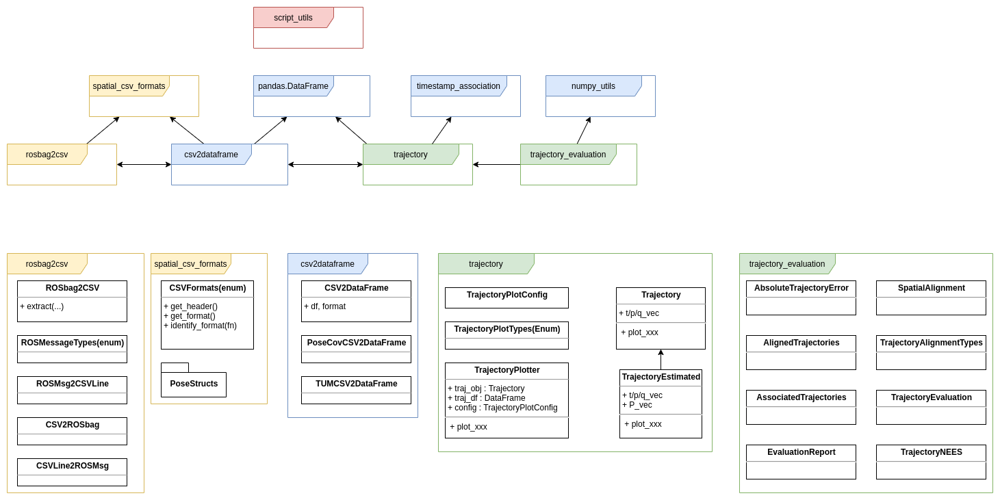

#  The CNS python package eco-system 

A repository to check out all packages of our eco-system, to set up a virtual environment, and finally to run all unit tests. 
The directory names of the submodules was modified intentionally to render the dependency graph manually, as `pip` is not able to resolve dependencies within a `requirements.txt` file.
If one wishes to add a new `git submodule`, think of an appropriate prefix. 
This allows us (i) to generate a `requirements.txt` file based on all submodules and (ii) to run all `pyhton unittests`. 

HINT: This project can also be used to develop/extend existing packages (submodules). 

## Overview of the cnspy eco-system


HINT: the diagram was created with [DrawIO](https://drawio-app.com/)

### Package List
- [cnspy_csv2dataframe](https://github.com/aau-cns/cnspy_csv2dataframe) and the [official package](https://pypi.org/project/cnspy-csv2dataframe/)
- [cnspy_numpy_utils](https://github.com/aau-cns/cnspy_numpy_utils) and the [official package](https://pypi.org/project/cnspy-numpy-utils/) 
- [cnspy_rosbag2csv](https://github.com/aau-cns/cnspy_rosbag2csv) and the [official package](https://pypi.org/project/cnspy-rosbag2csv/)
- [cnspy_rosbag2image](https://github.com/aau-cns/cnspy_rosbag2image) and the [official package](https://pypi.org/project/cnspy-rosbag2image/)
- [cnspy_script_utils](https://github.com/aau-cns/cnspy_script_utils) and the [official package](https://pypi.org/project/cnspy-script-utils/) 
- [cnspy_spatial_csv_formats](https://github.com/aau-cns/cnspy_spatial_csv_formats) and the [official package](https://pypi.org/project/cnspy-spatial-csv-formats/)
- [cnspy_timestamp_association](https://github.com/aau-cns/cnspy_timestamp_association) and the [official package](https://pypi.org/project/cnspy-timestamp-association/)
- [cnspy_trajectory](https://github.com/aau-cns/cnspy_trajectory) and the [official package](https://pypi.org/project/cnspy-trajectory/)
- [cnspy_trajectory_evaluation](https://github.com/aau-cns/cnspy_trajectory_evaluation) and the [official package](https://pypi.org/project/cnspy-trajectory-evaluation/) 

## Setup 
Clone the repository with all submodules:
```cmd
git clone --recurse-submodules -j8 git@github.com:aau-cns/cnspy_eco_system_test.git
```
or after cloning
```cmd
git submodule update --init --recursive
```


Then run the `source setup-env.sh` that will
1) generate the `requirements.txt` based on the submodules
2) install a virtual environment `python-venv`
3) activate the local interpreter `(venv)` or launch [PyCharm](https://www.jetbrains.com/pycharm/) from the root.


## Unit-tests

After the setup, simply run `run_tests.sh` and wait (some windows of plots need to be closed as they are blocking!).

## Upload packages

To upload the files to `PyPI` (or `Test PyPI` by uncommenting command) is automated by running `upload_packages.sh`. 
Follow the [official documentation](https://packaging.python.org/tutorials/packaging-projects/) and you might have to configure the `API token`. 

## Develop 

One can use this repository to modify or extend our package eco-system. A good choice is to the IDE [PyCharm](https://www.jetbrains.com/pycharm/).
As the dependencies (our new packages) have to be resolved properly, the IDE has to use our virtual Python environment.
Therefore, run the application in the root of the repository after the setup step was performed.
One will be asked to define a project interpreter, but reject it in the beginning. 
Then got to `File->Settings->Project:<>->Python Interpreter`. There `none` is selected, thus click on the setting button (*) to get the `Add` dialog.
Click on `Existing Interpreter` and navigate to `<root>/python-venv/env/bin/python3`. Now everything should be working.
A quick check is to run a test in the package `trajectory_evaluation` (e.g. [test_TrajectoryNEES.py](./pkgs/f_trajectory_evaluation/test/test_TrajectoryPosOrientNEES.py)).

### Develop a new package

1. Create a new git repository containing initial files for the python package (LICENCE, README.md, RELEASE, setup.py, requirements.txt, folders: test, <package_name>) copy and modify from e.g, the [cnspy_spatial_csv_formats]((https://github.com/aau-cns/cnspy_spatial_csv_formats) package.  
2. Add it as a submodule under the folder `pkgs`, with an alphabetical prefix referring to the top-level dependency. E.g. `d_csv2dataframe` requires `b_spatial_csv_formats`. The prefix is needed to create automatically the `requirements.txt` file!
3. If the have already create a virtual environment in the root of `cnspy_eco_system_test`, source the python environment (`cnspy_eco_system_test$ source python-venv/env/bin/activate`), recreate the reqirements.txt by `cnspy_eco_system_test$ ./generate_requirements.sh`, and install all packages again by `(env) <>/cnspy_eco_system_test$ pip install -r requirements.txt`
4. Now, the new package is in the environment and can be developed/modified in `Pycharm` that is launch in the root with the virtual-environment selected.

## License

Software License Agreement (MIT  License), refer to the LICENSE file.

*Sharing is caring!* - [Roland Jung](https://github.com/jungr-ait)  
